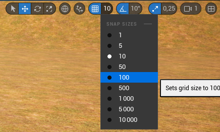

# Workshop UnrealEngine Part 2

## Introduction

Bienvenue dans ce workshop UnrealEngine.

Dans ce workshop, nous allons apprendre à créer un décor dans UnrealEngine.

Nous allons donc apprendre à utiliser les outils de base d'UnrealEngine pour créer un décor.

Nous allons aussi apprendre à utiliser les Blueprints pour créer des objets réutilisables.

Ce workshop est découpé en 3 parties :

- Partie 1 : [Création/Sculpture/Peinture du terrain](https://github.com/Kenan-Blasius/Workshop-UnrealEngine-Part-1)
- Partie 2 (ce workshop) : [Création de décors](https://github.com/Kenan-Blasius/Workshop-UnrealEngine-Part-2)
- Partie 3 : Création d’un Level avec un personnage jouable

## Création d'une salle

Afin de créer une salle, nous allons utiliser les outils de base d'Unreal Engine.

Nous allons donc utiliser les formes géométriques de base pour créer notre salle.

Nous allons utiliser les asset présent dans le dossier `Content/StarterContent/Architecture` pour créer notre salle.

Posez un Floor_400x400 dans votre scène.

Vous pouvez voir que le Floor_400x400 est glitché, pour régler ce problème, il vous suffit de le faire monté à l'aide de la flèche bleu.

Cependant, maintenant que le Floor_400x400 est monté, il est trop haut, il faut donc le faire descendre.

Pour ce faire il y a trois solutions :

- Soit vous le faites descendre à l'aide de la flèche bleu
- Soit vous le faites descendre en ajustant la valeur Z dans les détails de l'objet
- Soit vous appuyez sur la touche `End` de votre clavier en ayant sélectionné l'objet

Maintenant que le Floor_400x400 est bien placé, nous allons pouvoir le dupliquer pour agrandir notre salle.

Pour ce faire, il y a deux solutions :

- Soit vous appuyez sur la touche `Alt` de votre clavier et vous déplacez l'objet
- Soit vous faites un clic droit sur l'objet et vous cliquez sur `Edit` > `Duplicate`

Cependant il y a un problème, les deux Floor_400x400 sont compliquer à aligner parfaitement.

Pour régler ce problème, vous pouvez ajuster le padding dans l'engine pour déplacer les objets avec une précision de 100 unités (contre 10 par défaut).

Pour faire ce changement, rendez vous en haut à droite de la vue 3D et cliquez sur le `10` à droite de la grille bleue et mettez `100`.

Vous pouvez donc ajuster votre padding pour aligner parfaitement vos deux Floor_400x400.

Continuer à dupliquer vos Floor_400x400 pour avoir une salle en 3x3 (9 Floor_400x400).

> [!tip]
> Pensez à créer un dossier `Room` et un sous dossier `Floor` dans l'Outliner pour y mettre vos Floor_400x400 et ainsi avoir une scène plus propre.
> 

Maintenant que nous avons notre sol, nous allons pouvoir créer les murs.

Pour ce faire, nous allons utiliser les Wall_400x400.

Créez donc des murs pour faire le tour de votre salle et pensez à enlever un mur pour faire une porte.

Cependant, pour ce faire il va vous falloir faire des rotations.

Pour faire une rotation, rendez vous en haut à droite de la vue 3D et les 2 flèches tournant en rond pour passer en mode rotation.

Vous pouvez maintenant faire des rotations sur vos objets et donc posez tous vos murs correctement.

Votre salle devrait ressembler à ça :

Maintenant que nous avons notre salle, nous allons pouvoir créer une porte.

Pour ce faire, nous allons utiliser les Wall_Door_400x400.

Posez donc un Wall_Door_400x400 à la au niveau du trou que vous avez fait dans votre salle.

Maintenant que nous avons notre salle et notre porte, nous allons pouvoir créer un plafond.

Pour ce faire, nous allons utiliser dupliquer notre sol et le faire monter.

Dupliquez donc votre sol et faites le monter.

> [!tip]
> Pensez à réorganiser votre Outliner pour avoir une scène plus propre.

## Habillage de la salle

Maintenant, rentrez dans votre salle, nous allons l'habiller.

Pour ce faire, nous allons utiliser les asset présent dans le dossier `Content/StarterContent/Props`.

Ajoutons donc une table (SM_TableRound) et une chaise (SM_Chair) dans notre salle.

Nous allons maintenant ajouter une lumière murale (SM_Lamp_Wall) dans notre salle.

Mais notre lampe n'éclaire pas assez, nous allons donc ajouter une lumière spot (SpotLight).

Pour ce faire, cliquez sur votre lampe et cliquez sur `Add` et cherchez `SpotLight`.

Vous pouvez maintenant ajuster votre lumière spot à l'aide les flèches pour qu'elle éclaire correctement notre salle.

Maintenant rendez vous dans le dossier `Content/StarterContent/Material` et appliquez :

- le matériau `M_Brick_Clay_Beveled` sur vos murs.
- le matériau `M_Wood_Pine` sur votre sol.
- le matériau `M_Concrete_Pourred` sur votre plafond.

Votre salle devrait ressembler à ça :

Cependant notre lumière spot n'est pas trop réaliste, nous allons donc la modifier.

Pour ce faire, cliquez sur votre lumière spot et rendez vous dans les détails de l'objet.

Effectuez les changements suivants :

- Réduisez la valeur `Intensity` à `1000`.
- Augmentez la valeur `Attenuation Radius` à `1747`.
- Augmentez la valeur `Inner Cone Angle` à `50`.
- Augmentez la valeur `Outer Cone Angle` à `80`.
- Changez la couleur de la lumière en RGB `255, 235, 193`.

Cliquez sur la mesh de votre Lumière murale et décochez la case `Cast Shadows`.

Votre salle devrait ressembler à ça maintenant :

Notre salle manque un peu de fenêtre, nous allons donc en ajouter.

Pour ce faire, nous allons utiliser les asset présent dans le dossier `Content/StarterContent/Architecture`.

Nous pourrions supprimer un mur et ajouter une fenêtre, cependant nous allons utiliser une autre méthode.

Nous allons cliquez sur un mur et allons dans les détails de l'objet pour modifier sa `Static Mesh`.

Nous allons donc remplacer notre mur par un mur avec une fenêtre (Wall_Window_400x400).

Vous devriez maintenant avoir une salle avec une fenêtre comme ceci :

## Création de Blueprints

Nous avons une lumière murale, nous allons en mettre une par mur.

Pour ce faire il nous faudrait replacer une lumière murale et la reconfigurer à chaque fois, cependant il existe une solution plus simple.

On pourrait penser à dupliquer la lumière murale, cependant si on souhaite créer une nouvelle lumière murale, il nous faudrait en retrouver une déjà configurée pour la dupliquer.

Il existe donc une solution plus simple, les Blueprints.

Les Blueprints sont des objets qui peuvent contenir d'autres objets, qui peuvent être ajoutés à la scène tout comme l'on a ajouté notre table et notre chaise, contenir des variables, des fonctions, etc...

Nous allons donc créer un Blueprint pour notre lumière murale.

Rendez vous dans le dossier `Content` et créez un Blueprint de type `Actor`.

Double cliquez sur votre Blueprint pour l'ouvrir.

Ajoutez une lumière murale (SM_Lamp_Wall) dans votre Blueprint.

Ajoutez maintenant une lumière spot (SpotLight) dans votre Blueprint et ajustez la pour qu'elle éclaire correctement notre salle.

Vous devriez avoir quelque chose comme ça :

Remplacez maintenant la lumière murale par le Blueprint que vous venez de créer.

Si vous avez bien fait les choses, vous ne devriez pas voir de différence.

Vous pouvez donc ajouter d'autre lumière murale en utilisant votre Blueprint.

## Conclusion

Vous avez maintenant les bases pour créer des Blueprints et créer des décors à partir d'asset déjà existant.

Vous pouvez vous amuser à créer d'autre décors et à les mettre dans des Blueprints afin de les réutiliser.
